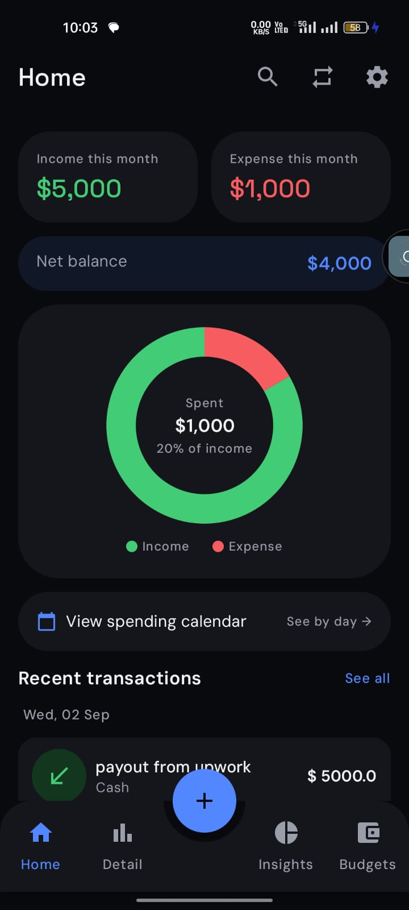
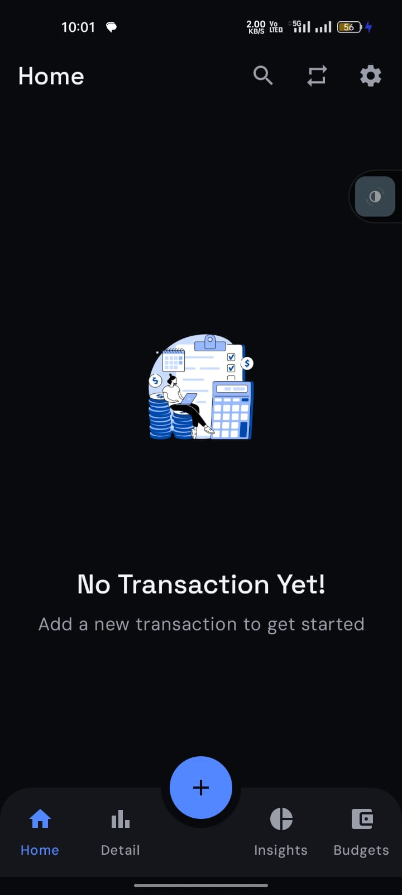
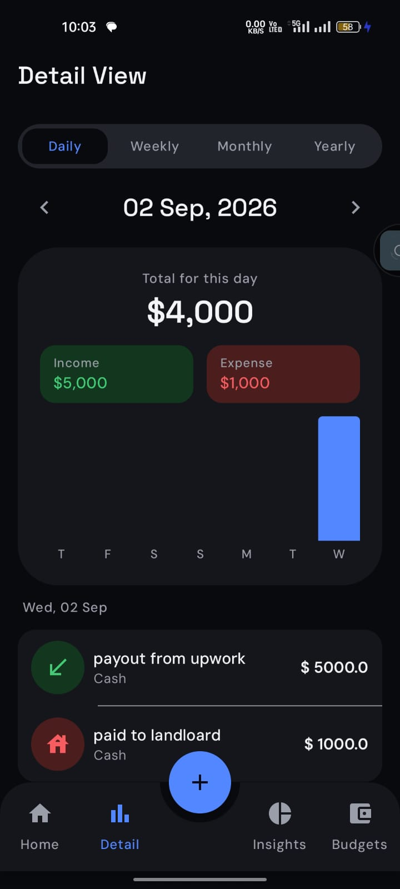
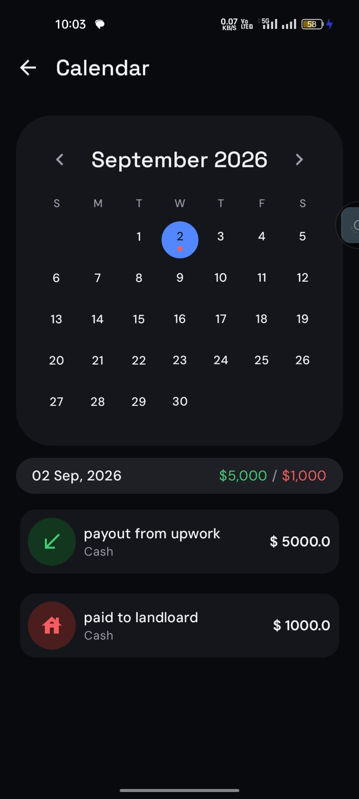
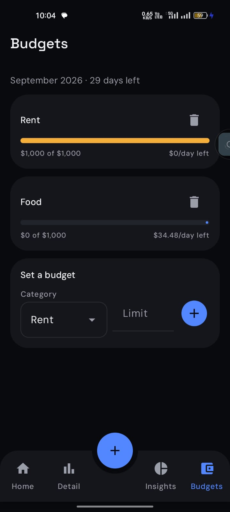
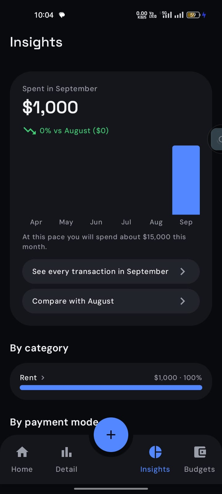
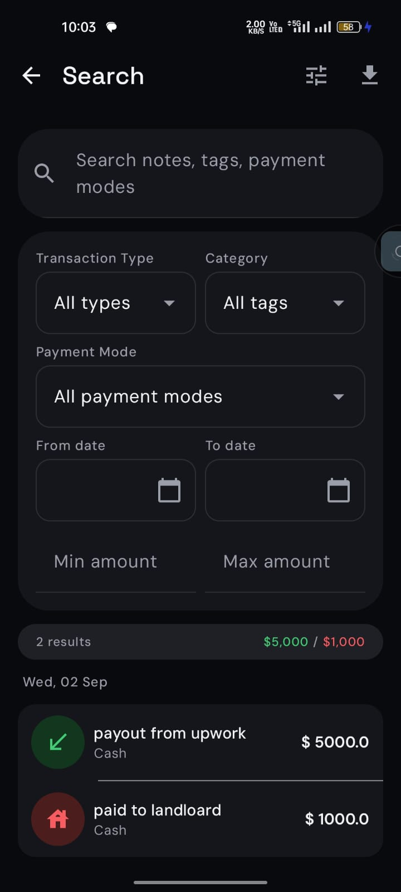
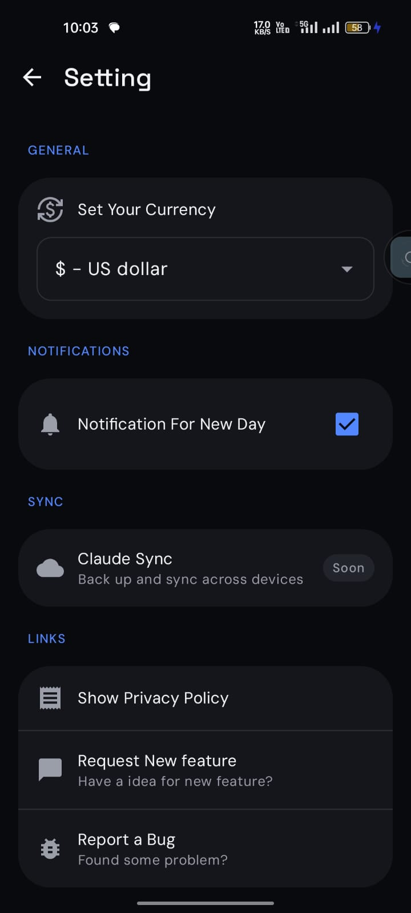

# Wallet

A simple, clean app to track your daily expenses and income — built entirely with Jetpack Compose.

-brightgreen)
-brightgreen)

## Screenshots

   
   

## Features

- Track income and expenses with a fast add/edit flow
- Budgets — set spending limits per category and track progress
- Recurring transactions — automate regular income/expenses
- Insights — spending trends and breakdowns over time
- Weekly, monthly, and yearly detail views with charts
- Calendar view of transactions
- In-app search across transactions
- CSV export
- Daily/recurring reminder notifications
- Light and dark theme

## Tech Stack

- **UI:** Jetpack Compose, Material 3
- **Navigation:** Jetpack Navigation 3
- **Architecture:** MVVM, Hilt for DI
- **Persistence:** Room (with migrations), DataStore Preferences
- **Background work:** WorkManager (recurring transactions, reminders)
- **Build:** Gradle Kotlin DSL with a version catalog
- **Testing:** JUnit, Compose UI tests, Room instrumented tests

## Getting Started

1. Clone or fork this project
2. Create a Firebase project and add your `google-services.json` to `app/` for Crashlytics/Analytics
3. Open in Android Studio and run

## License

[MIT](https://choosealicense.com/licenses/mit/)
